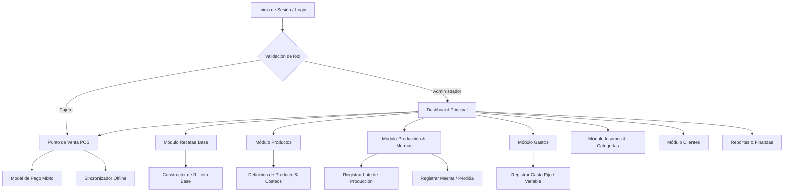
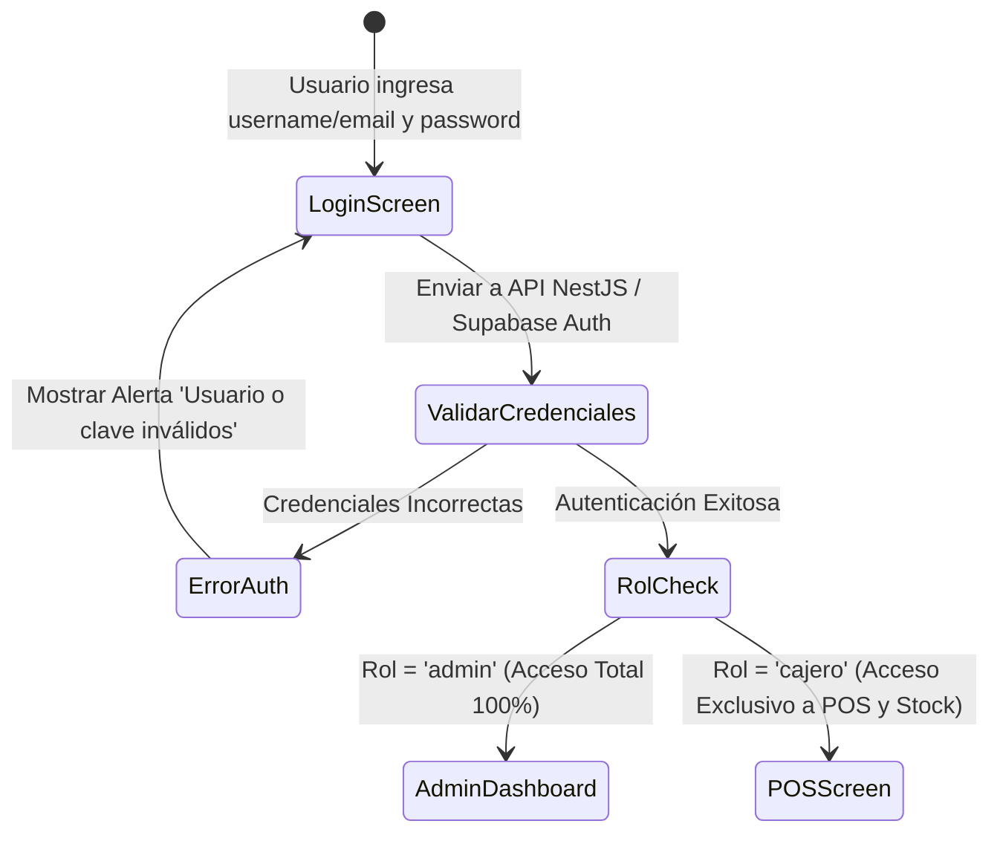
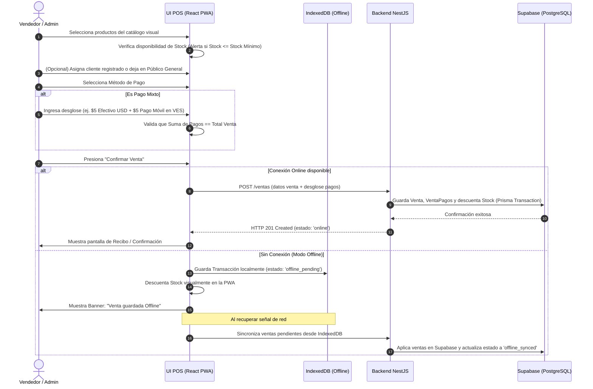
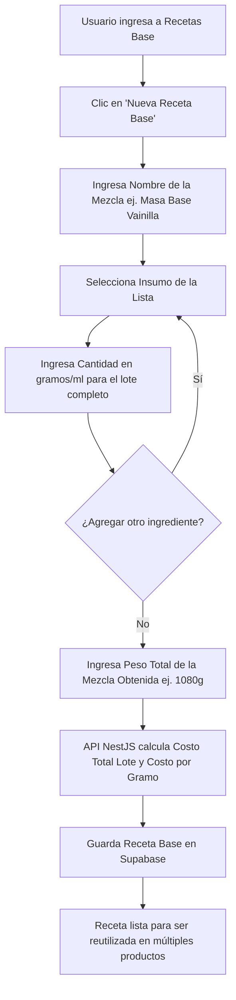
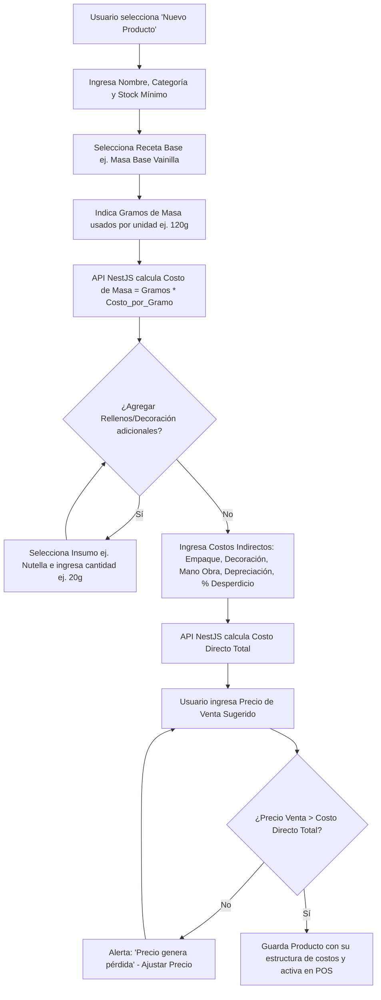
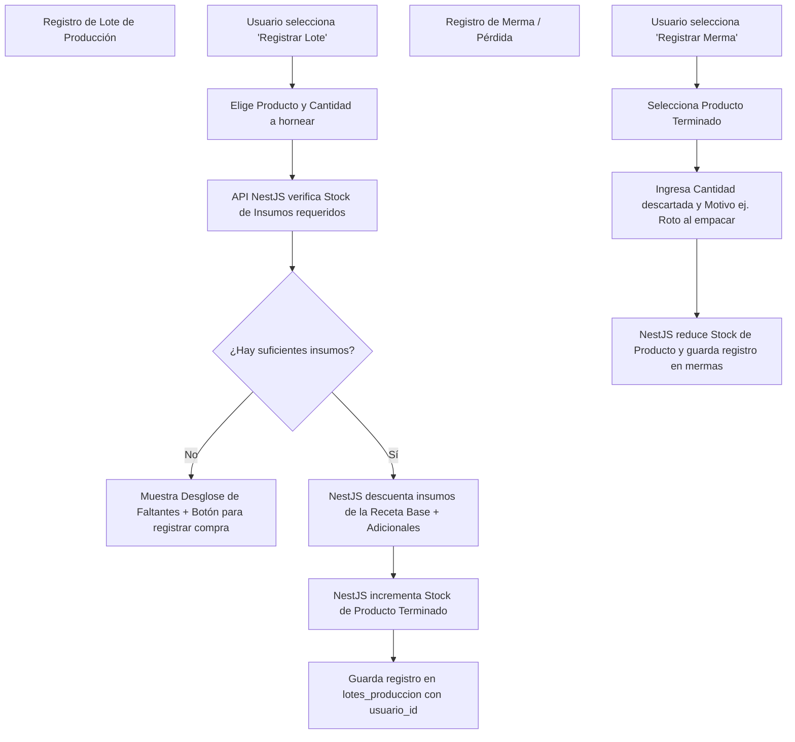
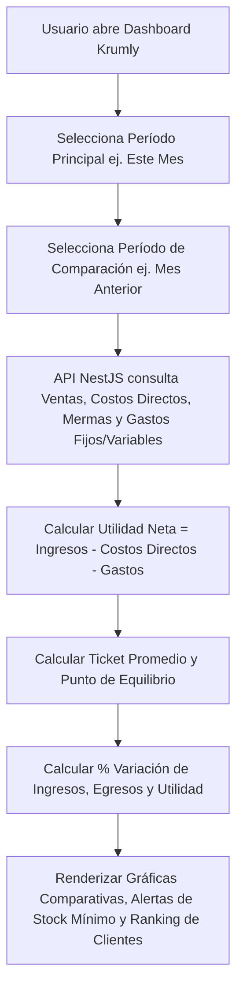

# Flujos de Navegación y Mapa del Sitio (User Journeys)
## Krumly Manager - Sistema de Gestión y Control Operativo para Repostería

Este documento define la arquitectura de navegación de usuario (UX) y el mapa del sitio para **Krumly Manager**, modelado en código estandarizado **Mermaid.js**.

---

## 1. Mapa del Sitio (Sitemap General)

---

## 2. Flujo de Autenticación y Control de Acceso (RBAC)

---

## 3. Flujo POS de Ventas, Pago Mixto y Sincronización Offline

---

## 4. Flujo de Cocina: Creación de Receta Base

---

## 5. Flujo de Producto y Costeo Desacoplado

---

## 6. Flujo de Producción y Mermas

---

## 7. Flujo de Gastos Operativos y Dashboard Financiero

